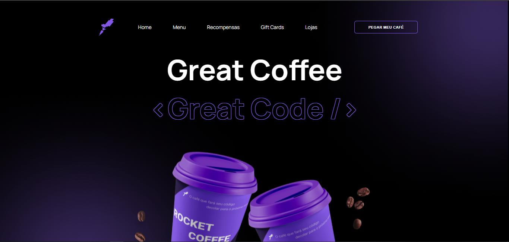
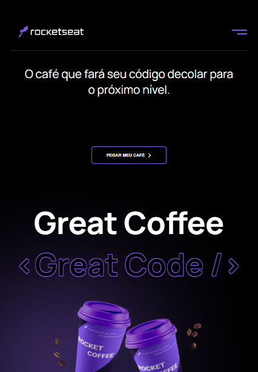
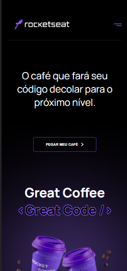
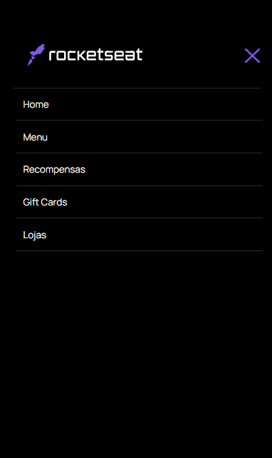

<h1 align="center"> Great Coffee  </h1>

## 🚀 Tecnologias utilizadas

- HTML
- CSS
- JavaScript

## 💻 Sobre o Projeto

Esse projeto veio de um desafio na plataforma da Rockeseat
 
Tendo um layout bonito e reponsivo, e toda uma lógica aplicada com JavaScript.
 

<h2>
    Acesse este <a href="https://diegoprocopio0.github.io/desafio-rocket-coffee/">link</a> ver online.
</h2>

## Images do projeto

Desktop
 

Tablet
 

Mobile
 

Menu Toggle
 

By Diego Silva 

